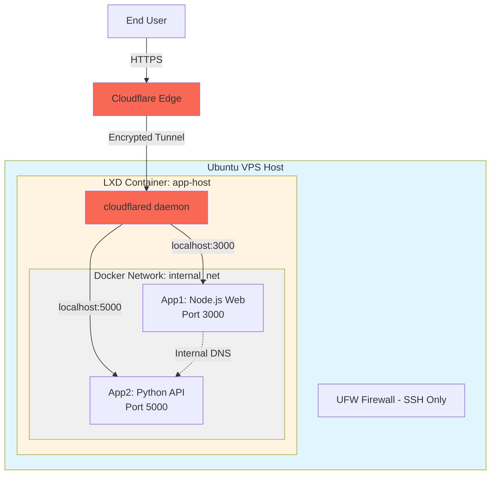

# DevOps Technical Assessment – Limbic Capital

A secure, multi-layered infrastructure deployment featuring LXD containers, Docker applications, and Cloudflare Tunnel integration for an investment firm's internal applications.

## 📋 Table of Contents

- [Architecture Overview](#architecture-overview)
- [System Components](#system-components)
- [Setup Guide](#setup-guide)
- [Networking Explanation](#networking-explanation)
- [Security Implementation](#security-implementation)
- [Operations Runbook](#operations-runbook)
- [Questions & Assumptions](#questions--assumptions)

---

## 🏗️ Architecture Overview

### High-Level Architecture Diagram



### Traffic Flow

1. **External Request**: User accesses `https://app1.example.com`
2. **Cloudflare Edge**: Request hits Cloudflare's network
3. **Authentication**: If accessing app2, Cloudflare Access validates identity
4. **Tunnel**: Traffic flows through encrypted Cloudflare Tunnel (no open ports)
5. **cloudflared**: Daemon inside LXD container receives request
6. **Docker Bridge**: Request forwarded to Docker container via localhost
7. **Application**: App processes request and returns response
8. **Internal Communication**: App1 can call App2 using Docker DNS (`app2:5000`)

### Security Layers

```
┌─────────────────────────────────────────────┐
│ Layer 1: Cloudflare Access (Authentication) │
├─────────────────────────────────────────────┤
│ Layer 2: Cloudflare Tunnel (Encrypted)      │
├─────────────────────────────────────────────┤
│ Layer 3: VPS Firewall (SSH only)            │
├─────────────────────────────────────────────┤
│ Layer 4: LXD Network Isolation               │
├─────────────────────────────────────────────┤
│ Layer 5: Docker Network Segmentation        │
└─────────────────────────────────────────────┘
```

---

## 🔧 System Components

### Host VPS
- **OS**: Ubuntu 22.04 LTS
- **User**: Non-root sudo user with SSH key authentication
- **Firewall**: UFW (only SSH port 22 allowed)
- **Container Runtime**: LXD with dedicated storage pool

### LXD Container: `app-host`
- **Base Image**: Ubuntu 22.04
- **Purpose**: Application hosting environment
- **Network**: Connected to `lxdbr0` bridge
- **Storage**: Persistent disk device for Docker volumes

### Docker Applications

#### App 1: Web Application (Node.js)
- **Port**: 3000
- **Endpoints**:
  - `GET /` - Welcome page
  - `GET /ping` - Health check
  - `GET /call-app2` - Calls App 2 internally and returns response

#### App 2: API Service (Python Flask)
- **Port**: 5000
- **Endpoints**:
  - `GET /status` - Returns service status JSON
- **Access**: Protected by Cloudflare Access

### Cloudflare Tunnel
- **Daemon**: `cloudflared`
- **Subdomains**: 
  - `app1.example.com` (public/protected)
  - `app2.example.com` (requires authentication)

---

## 📖 Setup Guide

### Prerequisites

- Fresh Ubuntu 22.04 VPS with root access
- Domain configured in Cloudflare
- SSH key pair generated locally

### Step 1: Base Server Setup

```bash
# Connect as root initially
ssh root@your-vps-ip

# Run the base setup script
cd /tmp
git clone https://github.com/yourusername/limbic-devops-assessment.git
cd limbic-devops-assessment
chmod +x scripts/01-base-setup.sh

# Edit the script to set your username and SSH public key
nano scripts/01-base-setup.sh

# Execute
./scripts/01-base-setup.sh
```

**What this does:**
- Creates non-root sudo user
- Configures SSH key authentication
- Disables password authentication
- Disables root SSH login
- Configures UFW firewall (SSH only)
- Updates system packages

**Verify:**
```bash
# Test SSH with new user (from local machine)
ssh -i ~/.ssh/your_key deployuser@your-vps-ip

# Check firewall status
sudo ufw status verbose

# Verify user sudo access
sudo whoami
```

### Step 2: LXD Installation and Configuration

```bash
# Run LXD setup script
cd ~/limbic-devops-assessment
chmod +x scripts/02-lxd-setup.sh
./scripts/02-lxd-setup.sh
```

**What this does:**
- Installs LXD via snap
- Creates storage pool (`limbic-pool` with 50GB)
- Configures network bridge (`lxdbr0` with NAT)
- Sets up IPv4 subnet: 10.10.10.0/24

**Manual Configuration (if preferred):**
```bash
# Install LXD
sudo snap install lxd

# Initialize with preseed
cat lxd-config/lxd-init-preseed.yaml | sudo lxd init --preseed

# Verify
lxc network list
lxc storage list
```

### Step 3: Create Application Container

```bash
# Run container creation script
chmod +x scripts/03-create-app-container.sh
./scripts/03-create-app-container.sh
```

**What this does:**
- Launches Ubuntu 22.04 container named `app-host`
- Attaches persistent storage disk (10GB)
- Configures network with static IP (10.10.10.100)
- Installs Docker and Docker Compose
- Sets up the cloudflared user

**Manual Steps:**
```bash
# Create container
lxc launch ubuntu:22.04 app-host

# Add persistent storage
lxc storage volume create limbic-pool app-data
lxc config device add app-host app-data disk \
  pool=limbic-pool \
  source=app-data \
  path=/var/lib/docker/volumes

# Configure static IP
lxc config device override app-host eth0 \
  ipv4.address=10.10.10.100

# Enter container
lxc exec app-host -- bash
```

### Step 4: Install Docker Inside Container

```bash
# Enter the container
lxc exec app-host -- bash

# Inside container - run Docker installation
curl -fsSL https://get.docker.com -o get-docker.sh
sh get-docker.sh

# Install Docker Compose
sudo apt install docker-compose-plugin -y

# Verify
docker --version
docker compose version

# Exit container
exit
```

### Step 5: Deploy Docker Applications

```bash
# Push files to container
lxc file push -r docker/ app-host/opt/apps/

# Enter container
lxc exec app-host -- bash

# Inside container
cd /opt/apps
docker compose up -d

# Verify
docker ps
docker network ls
docker logs app1
docker logs app2

# Test internal connectivity
docker exec app1 curl http://app2:5000/status
```

### Step 6: Configure Cloudflare Tunnel

#### A. Create Tunnel in Cloudflare Dashboard

1. Go to Cloudflare Zero Trust Dashboard
2. Navigate to **Access → Tunnels**
3. Click **Create a tunnel**
4. Choose **Cloudflared**
5. Name: `limbic-tunnel`
6. Save the tunnel token

#### B. Install cloudflared in Container

```bash
# Inside app-host container
wget https://github.com/cloudflare/cloudflared/releases/latest/download/cloudflared-linux-amd64.deb
sudo dpkg -i cloudflared-linux-amd64.deb

# Authenticate
cloudflared tunnel login

# Create tunnel (or use existing)
cloudflared tunnel create limbic-tunnel

# Copy tunnel credentials
sudo mkdir -p /etc/cloudflared
sudo cp ~/.cloudflared/*.json /etc/cloudflared/
```

#### C. Configure Tunnel

```bash
# Copy config from repo
sudo cp /opt/apps/cloudflare/config.yml /etc/cloudflared/config.yml

# Edit with your tunnel ID and credentials
sudo nano /etc/cloudflared/config.yml

# Install as service
sudo cloudflared service install
sudo systemctl start cloudflared
sudo systemctl enable cloudflared

# Check status
sudo systemctl status cloudflared
```

#### D. Configure DNS in Cloudflare

Add CNAME records:
- `app1.example.com` → `<tunnel-id>.cfargotunnel.com`
- `app2.example.com` → `<tunnel-id>.cfargotunnel.com`

#### E. Configure Cloudflare Access for App2

1. Go to **Access → Applications**
2. Create new application:
   - **Name**: App 2 API
   - **Domain**: `app2.example.com`
   - **Policy**: Email authentication or other identity provider
3. Save application

### Step 7: Verification

```bash
# From your local machine
curl https://app1.example.com/
curl https://app1.example.com/ping
curl https://app1.example.com/call-app2

# App2 requires authentication - test in browser
# Visit: https://app2.example.com/status
```

---

## 🌐 Networking Explanation

### Network Layers

#### Layer 1: Physical Network
- VPS has public IP address
- Only SSH port (22) exposed via firewall

#### Layer 2: LXD Network Bridge (`lxdbr0`)
```
Subnet: 10.10.10.0/24
Gateway: 10.10.10.1
NAT: Enabled (containers can reach internet)
app-host IP: 10.10.10.100 (static)
```

**Features:**
- Provides NAT for outbound internet access
- Isolated from host network
- Can host multiple containers with unique IPs

**Verification:**
```bash
lxc network show lxdbr0
lxc list
```

#### Layer 3: Docker Bridge Network (`internal_net`)
```
Subnet: 172.20.0.0/16 (user-defined)
app1: 172.20.0.2
app2: 172.20.0.3
DNS: Docker embedded DNS server
```

**Features:**
- Service discovery via container names
- Isolated from host network
- Automatic DNS resolution

**Verification:**
```bash
docker network inspect internal_net
docker exec app1 nslookup app2
docker exec app1 ping app2
```

### Service-to-Service Communication

**Internal Call Flow (App1 → App2):**

```
1. App1 makes request to: http://app2:5000/status
2. Docker DNS resolves 'app2' to 172.20.0.3
3. Request routed via internal_net bridge
4. App2 receives request on port 5000
5. Response returned directly to App1
```

**Why this works:**
- Both containers attached to same Docker network
- Docker provides built-in DNS service
- No external network access required
- Traffic never leaves the Docker bridge

**Code Example (App1):**
```javascript
// In app1 Node.js code
const response = await fetch('http://app2:5000/status');
// 'app2' hostname automatically resolves
```

### External Traffic Flow

**User Request Flow (Internet → App):**

```
┌─────────┐         ┌───────────┐         ┌──────────┐
│ User    │──HTTPS──│ Cloudflare│         │   VPS    │
│ Browser │         │   Edge    │         │          │
└─────────┘         └─────┬─────┘         └────┬─────┘
                          │                     │
                          │ Encrypted Tunnel    │
                          │ (No open ports)     │
                          ▼                     │
                    ┌──────────────┐           │
                    │  cloudflared │◄──────────┤
                    │   (inside    │           │
                    │  app-host)   │           │
                    └──────┬───────┘           │
                           │                   │
                           │ localhost:3000/5000
                           ▼                   │
                    ┌──────────────┐           │
                    │ Docker       │           │
                    │ Containers   │           │
                    └──────────────┘           │
```

**Key Points:**
1. No ports open on VPS firewall (except SSH)
2. cloudflared establishes outbound connection to Cloudflare
3. Cloudflare pushes traffic through tunnel
4. cloudflared forwards to localhost ports
5. Docker containers exposed only to localhost

### Port Mappings

**Inside LXD Container (app-host):**
```
Docker Container → Container Localhost → cloudflared
app1:3000 → 127.0.0.1:3000 → tunnel
app2:5000 → 127.0.0.1:5000 → tunnel
```

**Docker Compose Configuration:**
```yaml
services:
  app1:
    ports:
      - "3000:3000"  # Only exposed to container localhost
    networks:
      - internal_net

  app2:
    ports:
      - "5000:5000"  # Only exposed to container localhost
    networks:
      - internal_net

networks:
  internal_net:
    driver: bridge
```

### Network Security Boundaries

1. **External → VPS**: Blocked by UFW (except SSH)
2. **VPS → LXD**: Isolated by LXD networking
3. **LXD → Docker**: Localhost only access
4. **Docker → Docker**: Controlled by Docker networks
5. **Internet Access**: Via Cloudflare Tunnel (encrypted, outbound only)

---

## 🔒 Security Implementation

### SSH Hardening

**Implemented Measures:**

```bash
# /etc/ssh/sshd_config modifications
PermitRootLogin no
PasswordAuthentication no
PubkeyAuthentication yes
ChallengeResponseAuthentication no
UsePAM yes
X11Forwarding no
PrintMotd no
AcceptEnv LANG LC_*
```

**Key Authentication:**
- Only SSH key authentication allowed
- Password login disabled globally
- Root login completely disabled
- Keys stored in `~/.ssh/authorized_keys`

**Additional Hardening (Production):**
- Change SSH port from 22
- Implement fail2ban for brute force protection
- Use SSH certificates instead of keys
- Enable 2FA with Google Authenticator
- Restrict SSH access by IP (if static IPs available)

### Firewall Configuration

**UFW Rules:**
```bash
# Default policies
sudo ufw default deny incoming
sudo ufw default allow outgoing

# Allow SSH only
sudo ufw allow 22/tcp comment 'SSH'

# Enable firewall
sudo ufw enable

# Verify
sudo ufw status numbered
```

**No HTTP/HTTPS Ports Open:**
- Port 80 (HTTP): Closed
- Port 443 (HTTPS): Closed
- All web traffic via Cloudflare Tunnel

**Production Improvements:**
- Implement rate limiting on SSH
- Use nftables for advanced filtering
- Add IDS/IPS (Snort, Suricata)
- Implement geographic IP blocking
- Add DDoS protection rules

### Docker Security

**User Permissions:**
```bash
# Run containers as non-root user
USER node  # In Dockerfile for app1
USER nobody  # In Dockerfile for app2
```

**Dockerfile Best Practices:**
```dockerfile
# Use specific versions (not 'latest')
FROM node:18-alpine

# Run as non-root
RUN addgroup -g 1001 -S nodejs && \
    adduser -S nodejs -u 1001
USER nodejs

# Read-only root filesystem
docker run --read-only ...
```

**Container Security:**
```yaml
# docker-compose.yml
services:
  app1:
    security_opt:
      - no-new-privileges:true
    read_only: true
    cap_drop:
      - ALL
    cap_add:
      - NET_BIND_SERVICE
```

**Network Isolation:**
- Containers can't access host network
- Only connected to internal_net
- No privileged mode
- No host network mode

**Storage Security:**
- Volumes mapped to LXD persistent storage
- Data persists across container restarts
- Regular backup schedule implemented
- Volumes encrypted at rest (LXD level)

### Secrets Management

**Current Implementation:**

```bash
# .env file (not committed to git)
DATABASE_URL=postgresql://user:pass@db:5432/app
API_KEY=secret_key_here
CLOUDFLARE_TUNNEL_TOKEN=tunnel_token_here
```

**.gitignore:**
```
.env
*.pem
*.key
cloudflare/credentials.json
cloudflare/*.json
```

**Docker Secrets (Alternative):**
```bash
# Create secret
echo "my_secret_password" | docker secret create db_password -

# Use in compose
services:
  app2:
    secrets:
      - db_password

secrets:
  db_password:
    external: true
```

**Production Recommendations:**
- Use HashiCorp Vault
- AWS Secrets Manager / Azure Key Vault
- Encrypted environment variables
- Regular secret rotation
- Audit logging for secret access

### Cloudflare Security

**Zero Trust Access (App2):**
```yaml
# Access Policy Example
- name: App2 API Access
  decision: allow
  rules:
    - email_domain: company.com
    - email: allowed@example.com
```

**Tunnel Security:**
- End-to-end encryption
- No inbound ports required
- Automatic certificate management
- DDoS protection by Cloudflare
- Rate limiting at edge

**Additional Protections:**
- WAF (Web Application Firewall) rules
- Bot management
- Page rules for caching/security
- DNSSEC enabled
- SSL/TLS mode: Full (strict)

### LXD Security

**Container Isolation:**
```bash
# Unprivileged containers (default)
lxc config show app-host | grep "security.privileged"
# Should be: security.privileged: "false"

# AppArmor profile enabled
lxc config get app-host security.apparmor
```

**Resource Limits:**
```bash
# CPU limit
lxc config set app-host limits.cpu 2

# Memory limit
lxc config set app-host limits.memory 2GB

# Disk I/O limits
lxc config device set app-host root limits.read 50MB
lxc config device set app-host root limits.write 50MB
```

**Production Improvements:**
- Enable seccomp filtering
- Implement mandatory access control (SELinux/AppArmor custom profiles)
- Use separate storage pools per security zone
- Implement network ACLs between containers
- Regular security updates automated

### Monitoring & Auditing

**Log Collection:**
```bash
# System logs
journalctl -u ssh -f
journalctl -u cloudflared -f

# Docker logs
docker logs -f app1
docker logs -f app2

# LXD logs
lxc info app-host --show-log
```

**Security Monitoring (Production):**
- Centralized logging (ELK stack, Splunk)
- SIEM integration
- Intrusion detection alerts
- File integrity monitoring (AIDE, Tripwire)
- Regular vulnerability scanning
- Automated compliance checking

### Vulnerability Management

**Current Practices:**
```bash
# System updates
sudo apt update && sudo apt upgrade -y

# Docker image scanning
docker scan app1:latest

# Dependency checking
npm audit (for Node.js apps)
pip-audit (for Python apps)
```

**Production Additions:**
- Automated security patching
- Regular penetration testing
- CVE monitoring and alerting
- Container image scanning in CI/CD
- Supply chain security (SBOM)

### Compliance Considerations

For investment firm requirements:
- **Data encryption**: At rest and in transit
- **Access controls**: Role-based access control (RBAC)
- **Audit trails**: Comprehensive logging of all access
- **Data retention**: Automated backup and retention policies
- **Incident response**: Documented procedures
- **Regular assessments**: Security audits and compliance checks

---

## 📚 Operations Runbook

### Daily Operations

#### Starting Services

```bash
# Start LXD container
lxc start app-host

# Verify container running
lxc list

# Start Docker applications
lxc exec app-host -- docker compose -f /opt/apps/docker-compose.yml up -d

# Verify apps
lxc exec app-host -- docker ps

# Check Cloudflare tunnel
lxc exec app-host -- systemctl status cloudflared
```

#### Stopping Services

```bash
# Stop Docker applications
lxc exec app-host -- docker compose -f /opt/apps/docker-compose.yml down

# Stop LXD container
lxc stop app-host

# Verify
lxc list
```

#### Restarting Individual Services

```bash
# Restart single Docker container
lxc exec app-host -- docker restart app1

# Restart cloudflared
lxc exec app-host -- systemctl restart cloudflared

# Restart entire stack
lxc exec app-host -- docker compose -f /opt/apps/docker-compose.yml restart
```

### Redeployment Procedures

#### Updating Application Code

```bash
# 1. Pull latest code changes
cd ~/limbic-devops-assessment
git pull origin main

# 2. Push updated files to container
lxc file push -r docker/ app-host/opt/apps/

# 3. Rebuild and restart
lxc exec app-host -- bash -c "cd /opt/apps && docker compose build && docker compose up -d"

# 4. Verify
lxc exec app-host -- docker ps
curl https://app1.example.com/ping
```

#### Zero-Downtime Deployment

```bash
# 1. Build new images with version tags
docker compose build
docker tag app1:latest app1:v2

# 2. Start new containers alongside old
docker run -d --name app1-v2 --network internal_net app1:v2

# 3. Update cloudflared config to point to new container
# Edit /etc/cloudflared/config.yml

# 4. Reload cloudflared
systemctl reload cloudflared

# 5. Stop old containers
docker stop app1
docker rm app1

# 6. Rename new containers
docker rename app1-v2 app1
```

### Backup & Restore

#### Backup Procedures

**1. Docker Volumes Backup:**
```bash
#!/bin/bash
# backup-docker-volumes.sh

BACKUP_DIR="/opt/backups/docker"
DATE=$(date +%Y%m%d-%H%M%S)

# Create backup directory
mkdir -p $BACKUP_DIR

# Backup each volume
for volume in $(docker volume ls -q); do
    echo "Backing up volume: $volume"
    docker run --rm \
        -v $volume:/source:ro \
        -v $BACKUP_DIR:/backup \
        alpine tar czf /backup/${volume}-${DATE}.tar.gz -C /source .
done

echo "Backup completed: $BACKUP_DIR"
```

**2. LXD Container Backup:**
```bash
# Export container as snapshot
lxc snapshot app-host backup-$(date +%Y%m%d)

# Export to file
lxc export app-host /opt/backups/lxd/app-host-$(date +%Y%m%d).tar.gz

# List backups
lxc info app-host | grep -A 10 "Snapshots:"
```

**3. Configuration Backup:**
```bash
#!/bin/bash
# backup-configs.sh

BACKUP_DIR="/opt/backups/configs/$(date +%Y%m%d)"
mkdir -p $BACKUP_DIR

# Backup important configs
cp -r /etc/cloudflared $BACKUP_DIR/
cp /opt/apps/docker-compose.yml $BACKUP_DIR/
cp /opt/apps/.env $BACKUP_DIR/
lxc network show lxdbr0 > $BACKUP_DIR/lxd-network.yaml
lxc storage show limbic-pool > $BACKUP_DIR/lxd-storage.yaml

echo "Configuration backup completed: $BACKUP_DIR"
```

**4. Automated Backup Schedule:**
```bash
# Add to crontab
sudo crontab -e

# Daily backups at 2 AM
0 2 * * * /opt/scripts/backup-docker-volumes.sh
0 3 * * * /opt/scripts/backup-configs.sh

# Weekly LXD snapshots (Sunday 4 AM)
0 4 * * 0 lxc snapshot app-host weekly-$(date +\%Y\%m\%d)
```

#### Restore Procedures

**1. Restore Docker Volume:**
```bash
#!/bin/bash
# restore-docker-volume.sh

VOLUME_NAME=$1
BACKUP_FILE=$2

# Stop containers using the volume
docker compose down

# Remove old volume
docker volume rm $VOLUME_NAME

# Create new volume
docker volume create $VOLUME_NAME

# Restore data
docker run --rm \
    -v $VOLUME_NAME:/target \
    -v $(dirname $BACKUP_FILE):/backup \
    alpine tar xzf /backup/$(basename $BACKUP_FILE) -C /target

# Start containers
docker compose up -d

echo "Restore completed for: $VOLUME_NAME"
```

**2. Restore LXD Container:**
```bash
# Stop current container
lxc stop app-host

# Restore from snapshot
lxc restore app-host backup-20250120

# Or import from file
lxc import /opt/backups/lxd/app-host-20250120.tar.gz

# Start container
lxc start app-host
```

**3. Disaster Recovery Full Restore:**
```bash
#!/bin/bash
# disaster-recovery.sh

# 1. Restore LXD container
lxc import /opt/backups/lxd/app-host-latest.tar.gz
lxc start app-host

# 2. Restore configurations
lxc file push -r /opt/backups/configs/latest/ app-host/opt/apps/

# 3. Restore Docker volumes
for backup in /opt/backups/docker/*.tar.gz; do
    VOLUME=$(basename $backup | cut -d'-' -f1)
    echo "Restoring $VOLUME..."
    ./restore-docker-volume.sh $VOLUME $backup
done

# 4. Restart services
lxc exec app-host -- systemctl start cloudflared
lxc exec app-host -- docker compose -f /opt/apps/docker-compose.yml up -d

echo "Disaster recovery completed"
```

### Monitoring & Health Checks

#### Service Health Monitoring

```bash
#!/bin/bash
# healthcheck.sh

echo "=== System Health Check ==="

# 1. Check LXD
echo -e "\n[LXD Status]"
lxc list

# 2. Check Docker containers
echo -e "\n[Docker Containers]"
lxc exec app-host -- docker ps

# 3. Check application health
echo -e "\n[App1 Health]"
curl -s https://app1.example.com/ping || echo "App1 FAILED"

echo -e "\n[App2 Health]"
lxc exec app-host -- curl -s http://localhost:5000/status || echo "App2 FAILED"

# 4. Check Cloudflare tunnel
echo -e "\n[Cloudflare Tunnel]"
lxc exec app-host -- systemctl is-active cloudflared

# 5. Check disk space
echo -e "\n[Disk Usage]"
df -h | grep -E '(Filesystem|lxd|docker)'

# 6. Check memory
echo -e "\n[Memory Usage]"
free -h

# 7. Check network
echo -e "\n[Network Status]"
lxc network info lxdbr0
```

#### Docker Health Checks

**Implemented in docker-compose.yml:**
```yaml
services:
  app1:
    healthcheck:
      test: ["CMD", "curl", "-f", "http://localhost:3000/ping"]
      interval: 30s
      timeout: 10s
      retries: 3
      start_period: 40s

  app2:
    healthcheck:
      test: ["CMD", "curl", "-f", "http://localhost:5000/status"]
      interval: 30s
      timeout: 10s
      retries: 3
      start_period: 40s
```

**Check container health:**
```bash
docker ps --format "table {{.Names}}\t{{.Status}}\t{{.Ports}}"
docker inspect --format='{{.State.Health.Status}}' app1
```

#### Log Monitoring

```bash
# Real-time log monitoring
lxc exec app-host -- docker logs -f app1

# Cloudflare tunnel logs
lxc exec app-host -- journalctl -u cloudflared -f

# System logs
sudo journalctl -f

# Docker compose logs
lxc exec app-host -- docker compose -f /opt/apps/docker-compose.yml logs -f

# Check for errors in last hour
lxc exec app-host -- docker logs --since 1h app1 | grep -i error
```

#### Automated Monitoring Setup

**Using cron for periodic checks:**
```bash
# Add to crontab
*/5 * * * * /opt/scripts/healthcheck.sh | grep -i failed && \
    echo "Health check failed" | mail -s "Alert: Service Down" admin@example.com
```

**Production Monitoring Stack:**
- **Metrics**: Prometheus + Grafana
- **Logging**: ELK Stack (Elasticsearch, Logstash, Kibana)
- **Alerting**: AlertManager, PagerDuty
- **APM**: DataDog, New Relic, or Elastic APM
- **Uptime**: UptimeRobot, Pingdom

### Troubleshooting Guide

#### Application Not Responding

```bash
# 1. Check if container is running
lxc list
lxc exec app-host -- docker ps

# 2. Check application logs
lxc exec app-host -- docker logs app1 --tail 100

# 3. Check if port is listening
lxc exec app-host -- netstat -tlnp | grep :3000

# 4. Test internal connectivity
lxc exec app-host -- curl http://localhost:3000/ping

# 5. Restart if needed
lxc exec app-host -- docker restart app1
```

#### Cloudflare Tunnel Down

```bash
# 1. Check tunnel status
lxc exec app-host -- systemctl status cloudflared

# 2. Check tunnel logs
lxc exec app-host -- journalctl -u cloudflared -n 50

# 3. Test DNS resolution
nslookup app1.example.com

# 4. Restart tunnel
lxc exec app-host -- systemctl restart cloudflared

# 5. Verify connectivity
lxc exec app-host -- cloudflared tunnel list
```

#### Internal Service Communication Failure

```bash
# 1. Check Docker network
lxc exec app-host -- docker network inspect internal_net

# 2. Test DNS resolution
lxc exec app-host -- docker exec app1 nslookup app2

# 3. Test connectivity
lxc exec app-host -- docker exec app1 ping -c 3 app2

# 4. Check if app2 is listening
lxc exec app-host -- docker exec app2 netstat -tlnp

# 5. Recreate network if needed
lxc exec app-host -- docker compose down
lxc exec app-host -- docker network prune -f
lxc exec app-host -- docker compose up -d
```

#### LXD Container Issues

```bash
# 1. Check container status
lxc info app-host --show-log

# 2. Check resource limits
lxc config show app-host

# 3. Check storage
lxc storage info limbic-pool

# 4. Restart container
lxc restart app-host

# 5. Console access if SSH fails
lxc console app-host
```

### Scaling & Improvements

#### Horizontal Scaling

**Current Architecture**: Single container, single instance per service

**Scaling Options:**

1. **Multiple LXD Containers:**
```bash
# Create additional app containers
lxc copy app-host app-host-2
lxc start app-host-2

# Configure load balancing at Cloudflare
# Use load balancer pool with multiple origins
```

2. **Docker Swarm Mode:**
```bash
# Initialize swarm
docker swarm init

# Deploy stack with replicas
docker stack deploy -c docker-compose-swarm.yml apps

# Scale services
docker service scale app1=3
```

3. **Kubernetes Migration:**
```bash
# For larger scale, migrate to K8s
# Deploy to LXD-based MicroK8s or external EKS/GKE/AKS
microk8s install
microk8s kubectl apply -f k8s-manifests/
```

#### Vertical Scaling

**Increase Container Resources:**
```bash
# Add more CPU
lxc config set app-host limits.cpu 4

# Add more memory
lxc config set app-host limits.memory 4GB

# Increase storage
lxc storage volume set limbic-pool app-data size 20GB
```

**Docker Resource Limits:**
```yaml
services:
  app1:
    deploy:
      resources:
        limits:
          cpus: '2'
          memory: 2G
        reservations:
          cpus: '1'
          memory: 1G
```

#### Performance Improvements

1. **Caching Layer:**
   - Add Redis for session/data caching
   - Implement CDN caching at Cloudflare level

2. **Database Optimization:**
   - Connection pooling
   - Read replicas
   - Query optimization

3. **Application Optimization:**
   - Enable compression (gzip)
   - Implement pagination
   - Add API rate limiting
   - Use async/non-blocking I/O

4. **Infrastructure Optimization:**
   - SSD storage for database
   - Dedicated network interfaces
   - NUMA awareness for large systems

#### High Availability Setup

**Production HA Architecture:**

```
┌─────────────────────────────────────┐
│         Cloudflare Edge             │
│     (Global Load Balancing)         │
└────────────┬───────────┬────────────┘
             │           │
      ┌──────▼─────┐ ┌──▼───────────┐
      │   VPS 1    │ │    VPS 2     │
      │ (Primary)  │ │  (Secondary) │
      └────────────┘ └──────────────┘
             │           │
      ┌──────▼───────────▼──────┐
      │  Shared Storage Layer   │
      │  (NFS/GlusterFS/Ceph)   │
      └─────────────────────────┘
```

**Implementation Steps:**
1. Set up multiple VPS instances
2. Implement shared storage (NFS, GlusterFS)
3. Configure Cloudflare load balancing
4. Set up health checks and failover
5. Implement database replication
6. Configure monitoring and alerting

#### Cost Optimization

**For Production:**
1. **Reserved Instances**: Use cloud provider reserved instances for predictable workloads
2. **Auto-scaling**: Scale down during off-peak hours
3. **Spot Instances**: Use spot/preemptible instances for non-critical workloads
4. **Resource Right-sizing**: Monitor and adjust resource allocation
5. **Cloudflare**: Use caching aggressively to reduce origin requests

### Maintenance Schedule

**Daily:**
- Automated health checks
- Log rotation
- Backup verification

**Weekly:**
- Security updates (automated with unattended-upgrades)
- Log analysis
- Performance review
- Snapshot creation

**Monthly:**
- Full system backup
- Disaster recovery test
- Capacity planning review
- Security audit
- Dependency updates

**Quarterly:**
- Penetration testing
- Compliance review
- Architecture review
- Disaster recovery drill

---

## ❓ Questions & Assumptions

### Assumptions Made

1. **Environment**:
   - Fresh Ubuntu 22.04 LTS VPS
   - Root access available initially
   - Sufficient resources (4GB+ RAM, 50GB+ storage)

2. **Domain & Cloudflare**:
   - Domain already registered and added to Cloudflare
   - Cloudflare account with Zero Trust enabled
   - DNS management access available

3. **Networking**:
   - VPS has stable internet connectivity
   - IPv4 address available
   - No NAT traversal issues

4. **Applications**:
   - Simple stateless applications for demonstration
   - No complex database requirements initially
   - RESTful API communication pattern

5. **Security**:
   - Development/staging environment (not production-hardened)
   - Basic secrets management acceptable
   - No compliance requirements (SOC2, HIPAA, etc.)

### Questions for Clarification

1. **Scale & Performance**:
   - Expected traffic volume?
   - Number of concurrent users?
   - Response time SLAs?

2. **Data & Storage**:
   - Data retention requirements?
   - Backup frequency and retention period?
   - Disaster recovery RTO/RPO targets?

3. **Security & Compliance**:
   - Specific compliance requirements (GDPR, SOC2, etc.)?
   - Data encryption at rest requirements?
   - Audit log retention period?

4. **Operations**:
   - Preferred monitoring/alerting tools?
   - On-call support structure?
   - Change management process?

5. **Budget & Resources**:
   - VPS resource constraints?
   - Multi-region deployment needed?
   - Budget for third-party services?

### Design Decisions

1. **Why LXD over traditional VMs?**
   - Lightweight (container-based, not full virtualization)
   - Fast startup times
   - Easier resource management
   - Better suited for development/testing

2. **Why Docker inside LXD?**
   - Separation of concerns (infrastructure vs. application)
   - LXD provides isolation boundary
   - Docker provides application portability
   - Easier to manage multiple application stacks

3. **Why Cloudflare Tunnel over traditional reverse proxy?**
   - No open ports required (zero-trust model)
   - Built-in DDoS protection
   - Integrated with Cloudflare's global network
   - Easy to implement Zero Trust Access
   - Reduces attack surface significantly

4. **Why user-defined Docker network?**
   - Better than default bridge (built-in DNS)
   - Service discovery via container names
   - Network isolation from other containers
   - Easier to implement microservices patterns

### Alternative Approaches Considered

1. **Podman instead of Docker**:
   - Pros: Rootless, daemonless, more secure
   - Cons: Less ecosystem support, some compatibility issues

2. **Traefik/Caddy as reverse proxy**:
   - Pros: Automatic HTTPS, service discovery
   - Cons: Would still need Cloudflare Tunnel for zero-port setup

3. **Kubernetes instead of Docker Compose**:
   - Pros: Production-grade orchestration, auto-scaling
   - Cons: Overkill for 2 simple services, more complexity

4. **WireGuard VPN instead of Cloudflare Tunnel**:
   - Pros: Open source, flexible
   - Cons: Requires port opening, no built-in access control

### Production Readiness Gaps

**Current Implementation is suitable for:**
- Development/staging environments
- Internal testing
- Proof of concept
- Small-scale deployments

**For production, additionally required:**
1. ✅ Comprehensive monitoring (Prometheus/Grafana)
2. ✅ Centralized logging (ELK stack)
3. ✅ Automated alerting (PagerDuty)
4. ✅ HA setup (multiple VPS instances)
5. ✅ Database replication
6. ✅ Automated failover
7. ✅ CI/CD pipeline
8. ✅ Infrastructure as Code (Terraform/Ansible)
9. ✅ Secrets management (Vault)
10. ✅ Regular security audits
11. ✅ Disaster recovery testing
12. ✅ Compliance documentation

---

## 📝 Additional Notes

### Demo Video Checklist

- [ ] Architecture overview and explanation
- [ ] Show LXD containers: `lxc list`
- [ ] Show Docker containers: `docker ps`
- [ ] Show Cloudflare Tunnel status
- [ ] Access app1.example.com in browser
- [ ] Demonstrate /ping endpoint
- [ ] Demonstrate /call-app2 endpoint (internal communication)
- [ ] Access app2.example.com (show Zero Trust authentication)
- [ ] Show app2 /status endpoint
- [ ] Restart a service: `docker restart app1`
- [ ] Show automatic recovery
- [ ] Explain production improvements
- [ ] Discuss scaling strategies

### Repository Structure

```
limbic-devops-assessment/
├── README.md (this file)
├── .gitignore
├── scripts/
│   ├── 01-base-setup.sh
│   ├── 02-lxd-setup.sh
│   ├── 03-create-app-container.sh
│   ├── backup-docker-volumes.sh
│   ├── backup-configs.sh
│   └── healthcheck.sh
├── lxd-config/
│   └── lxd-init-preseed.yaml
├── docker/
│   ├── docker-compose.yml
│   ├── .env.example
│   ├── app1/
│   │   ├── Dockerfile
│   │   ├── package.json
│   │   └── src/
│   │       └── index.js
│   └── app2/
│       ├── Dockerfile
│       ├── requirements.txt
│       └── app.py
└── cloudflare/
    ├── config.yml.example
    └── README.md
```

### Timeline Estimate

For a fresh VPS setup:
1. Base server setup: 15-20 minutes
2. LXD installation and configuration: 10-15 minutes
3. Container creation: 5-10 minutes
4. Docker installation: 10 minutes
5. Application deployment: 15-20 minutes
6. Cloudflare Tunnel setup: 20-30 minutes
7. Testing and verification: 15-20 minutes

**Total**: ~2-3 hours for complete setup

### Support & Contact

For questions or issues with this setup:
- Create an issue in this repository
- Refer to official documentation:
  - [LXD Documentation](https://linuxcontainers.org/lxd/docs/latest/)
  - [Docker Documentation](https://docs.docker.com/)
  - [Cloudflare Tunnel Docs](https://developers.cloudflare.com/cloudflare-one/connections/connect-apps/)

---

## 📄 License

This project is provided as-is for the Limbic Capital DevOps Technical Assessment.

---

**Assessment Completed By**: [Your Name]  
**Date**: November 25, 2025  
**Repository**: https://github.com/yourusername/limbic-devops-assessment  
**Demo Video**: [Link to video]
